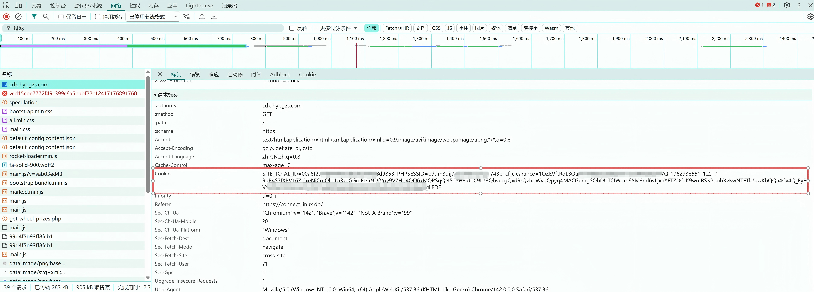
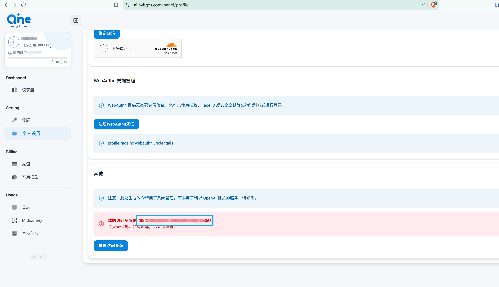

# 黑与白chatAPI自动签到工具

> 使用 Playwright 自动化工具，定时自动领取每日工资、幸运转盘奖励并自动兑换 CDK 码。

## 功能特点

- ✅ 自动领取每日工资
- ✅ 自动使用幸运转盘
- ✅ 自动兑换 CDK 码（通过 API）
- ✅ 通过 Cookie 实现免登录
- ✅ 支持环境变量参数化配置
- ✅ GitHub Actions 定时自动执行（每 6 小时）
- ✅ 错误截图自动保存
- ✅ 模块化代码结构

## 快速开始

### 前置要求

- Node.js 20 或更高版本
- npm 包管理器

### GitHub Actions 自动化部署

#### 1. Fork 本仓库

点击右上角的 Fork 按钮，将项目 Fork 到你的账号下。

#### 2. 创建 Environment

1. 进入仓库 Settings → Environments
2. 点击 "New environment"
3. 输入环境名称：`production`
4. 点击 "Configure environment"

#### 3. 配置 Secrets

在 `production` 环境中添加以下 Secrets：

| Secret 名称 | 说明 | 是否必需 |
|------------|------|---------|
| `CDK_COOKIE_STRING` | CDK 站点的 Cookie 字符串 | ✅ 必需 |
| `AI_API_KEY` | AI 站点的 API Key | ✅ 必需 |
| `AI_REDEEM_URL` | 兑换接口地址（默认：https://ai.hybgzs.com/api/user/topup） | ⚪ 可选 |

#### 4. 获取 Cookie 的方法

1. 打开浏览器，访问 https://cdk.hybgzs.com/
2. 登录你的账号
3. 按 F12 打开开发者工具
4. 切换到 "Network" (网络) 标签
5. 刷新页面
6. 找到任意请求，点击查看 Headers
7. 找到 "Cookie" 字段，复制整个 Cookie 字符串
8. 格式类似：`sessionid=abc123; token=xyz789; ...`


#### 5. 获取 API_KEY 的方法
1. 打开浏览器，访问 https://ai.hybgzs.com/
2. 登录你的账号
3. 进入到个人设置页面
4. 其他分类下找到访问令牌


#### 5. 启用 GitHub Actions

1. 进入仓库 Actions 标签
2. 如果提示工作流被禁用，点击 "I understand my workflows, go ahead and enable them"
3. 选择 "自动领取CDK" 工作流
4. 点击 "Run workflow" 测试运行

### 本地运行

#### 1. 克隆项目

```bash
git clone https://github.com/your-username/black-and-white-welfare.git
cd black-and-white-welfare
```

#### 2. 安装依赖

```bash
npm install
```

#### 3. 配置环境变量

复制 `.env.example` 为 `.env` 并填写必需的配置：

```bash
cp .env.example .env
```

编辑 `.env` 文件：

```env
# CDK 站点 Cookie（必需）
# 从浏览器开发者工具中复制，格式：cookie1=value1; cookie2=value2
CDK_COOKIE_STRING=your_cdk_cookie_here

# AI 站点 API Key（必需）
# 用于调用兑换接口
AI_API_KEY=your_api_key_here

# AI 站点兑换接口 URL（可选）
AI_REDEEM_URL=https://ai.hybgzs.com/api/user/topup
```

#### 4. 运行脚本

```bash
npm start
```

## 项目结构

```
.
├── .github/workflows/
│   └── daily-task.yml          # GitHub Actions 工作流配置
├── src/
│   ├── config.js               # 配置管理
│   ├── index.js                # 主程序入口
│   ├── tasks/                  # 任务模块
│   │   ├── salary.js          # 每日工资领取
│   │   ├── wheel.js           # 幸运转盘
│   │   └── redeem.js          # CDK 兑换
│   └── utils/                  # 工具函数
│       ├── browser.js         # 浏览器操作
│       └── helpers.js         # 辅助函数
├── tmp/                        # 临时文件目录
│   └── cdk.txt                # CDK 码存储（临时）
├── images/                     # 错误截图存储
├── .env.example               # 环境变量示例
├── .gitignore                 # Git 忽略配置
├── package.json               # 项目依赖
├── PROJECT_STRUCTURE.md       # 项目结构文档
├── CHANGELOG.md               # 版本变更记录
└── README.md                  # 项目说明
```

## 定时执行说明

当前配置：**每 2 小时自动执行一次**

修改定时：编辑 `.github/workflows/daily-task.yml` 中的 cron 表达式

```yaml
schedule:
  - cron: '0 */2 * * *'  # 每 2 小时执行
```

常用 cron 表达式：

| 表达式 | 说明 |
|--------|------|
| `0 */2 * * *` | 每 2 小时执行一次 |
| `0 */6 * * *` | 每 12 小时执行一次 |
| `0 1 * * *` | 每天 UTC 1:00（北京时间 9:00） |
| `0 0,12 * * *` | 每天 0:00 和 12:00 执行 |

## 工作流程

```
┌─────────────────────────────────────────────────────────────┐
│  1. 访问 CDK 站点（https://cdk.hybgzs.com/）                │
│     - 使用 CDK_COOKIE_STRING 免登录                         │
│     - 处理公告弹窗                                           │
│     - 检查登录状态                                           │
└─────────────────────────────────────────────────────────────┘
                              ↓
┌─────────────────────────────────────────────────────────────┐
│  2. 领取每日工资                                             │
│     - 点击工资按钮                                           │
│     - 读取 CDK 码                                           │
│     - 保存到 tmp/cdk.txt                                    │
└─────────────────────────────────────────────────────────────┘
                              ↓
┌─────────────────────────────────────────────────────────────┐
│  3. 使用幸运转盘                                             │
│     - 循环抽奖（最多 10 次）                                 │
│     - 读取中奖 CDK 码                                       │
│     - 追加保存到 tmp/cdk.txt                                │
└─────────────────────────────────────────────────────────────┘
                              ↓
┌─────────────────────────────────────────────────────────────┐
│  4. 关闭 CDK 站点                                            │
└─────────────────────────────────────────────────────────────┘
                              ↓
┌─────────────────────────────────────────────────────────────┐
│  5. 兑换 CDK 码（通过 API）                                  │
│     - 读取 tmp/cdk.txt 中的所有 CDK                         │
│     - 调用 AI_REDEEM_URL 接口逐个兑换                       │
│     - 兑换成功：从文件中移除                                 │
│     - 兑换失败：保留在文件中，下次继续尝试                    │
└─────────────────────────────────────────────────────────────┘
                              ↓
┌─────────────────────────────────────────────────────────────┐
│  6. 结果处理                                                 │
│     - 全部成功：清空 cdk.txt，退出码 0                      │
│     - 存在失败：保留失败的 CDK，退出码 1                     │
└─────────────────────────────────────────────────────────────┘
```

## 故障排查

### 常见问题

#### 1. 登录失败

**问题：** 日志显示 "❌ 登录失败，请检查 CDK_COOKIE_STRING 是否有效"

**原因：**
- Cookie 已过期
- Cookie 格式不正确
- 账号密码被修改

**解决方案：**
1. 重新获取 Cookie（参考上面的"获取 Cookie 的方法"）
2. 更新 GitHub Environment 中的 `CDK_COOKIE_STRING`
3. 重新运行工作流测试

#### 2. 兑换失败

**问题：** 日志显示 "❌ 兑换失败"

**原因：**
- API Key 无效或过期
- CDK 码已被使用
- CDK 码格式错误
- 网络问题

**解决方案：**
1. 检查 `AI_API_KEY` 是否正确
2. 查看日志中的具体错误信息
3. 失败的 CDK 会保留在文件中，下次自动重试

#### 3. 未找到按钮

**问题：** 日志显示 "⚠️ 未找到工资按钮" 或 "⚠️ 未找到抽奖按钮"

**原因：**
- 网站页面结构发生变化
- 今日已经领取过
- 页面加载未完成

**解决方案：**
1. 查看 GitHub Actions 上传的错误截图
2. 如果是页面结构变化，需要更新选择器
3. 如果已领取过，属于正常情况

#### 4. Actions 未自动运行

**问题：** GitHub Actions 没有按计划自动执行

**原因：**
- 工作流被禁用
- 仓库长期未活动被暂停
- GitHub 服务延迟

**解决方案：**
1. 检查 Actions 标签，确认工作流已启用
2. 手动触发一次工作流激活
3. 提交一个小改动（如更新 README）重新激活仓库

### 查看日志和截图

GitHub Actions 会自动保存执行日志和错误截图：

1. 进入仓库 Actions 标签
2. 点击对应的运行记录
3. 查看 "运行自动化脚本" 步骤的详细日志
4. 如果失败，下载 "error-screenshots" 工件查看截图

## 注意事项

### 🔒 安全提示

- ⚠️ **不要将 `.env` 文件提交到公开仓库**
- ⚠️ **不要在代码中硬编码敏感信息**
- ✅ 使用 GitHub Environments + Secrets 存储敏感信息
- ✅ 定期更换密码和 Cookie（建议每月）
- ✅ 使用强密码和双因素认证

### ⚠️ Cookie 失效处理

Cookie 可能因以下原因失效：

- 过期时间到期（通常 7-30 天）
- 密码被修改
- 网站更新认证机制
- IP 地址变化限制
- 安全策略变更

**解决方案：** 重新获取 Cookie 并更新 Environment Secrets

### 📝 合规使用

- 本工具仅供学习和个人使用
- 请遵守网站的使用条款和服务协议
- 不要用于商业用途
- 不要滥用或频繁请求导致服务器压力
- 尊重网站的反爬虫策略

## 技术栈

- **Node.js 20+** - JavaScript 运行环境
- **Playwright** - 浏览器自动化框架
- **GitHub Actions** - CI/CD 自动化平台
- **dotenv** - 环境变量管理

## 更新日志

查看 [CHANGELOG.md](CHANGELOG.md) 了解详细的版本变更记录。

## 贡献指南

欢迎提交 Issue 和 Pull Request！

1. Fork 本仓库
2. 创建你的特性分支 (`git checkout -b feature/AmazingFeature`)
3. 提交你的改动 (`git commit -m 'Add some AmazingFeature'`)
4. 推送到分支 (`git push origin feature/AmazingFeature`)
5. 打开一个 Pull Request

## 许可证

本项目采用 MIT 许可证 - 查看 [LICENSE](LICENSE) 文件了解详情

## 免责声明

本项目仅供学习交流使用，使用本工具产生的任何后果由使用者自行承担。请遵守相关网站的使用条款和法律法规。作者不对使用本工具导致的任何问题负责。

## 致谢

- [Playwright](https://playwright.dev/) - 强大的浏览器自动化框架
- [GitHub Actions](https://github.com/features/actions) - 优秀的 CI/CD 平台

---

如有问题，欢迎提交 [Issue](../../issues) 反馈。
